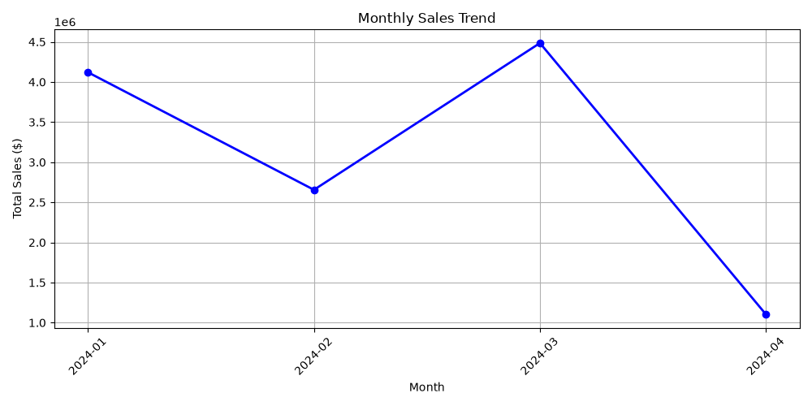

# Customer Sales Analysis Report
**Advanced Data Manipulation, Aggregation, and Performance Dashboard**

---

## 1. Executive Summary & Key Metrics
This report provides an in-depth analysis of customer purchasing patterns, revenue generation, and product performance using advanced Pandas manipulations. Below are the core Key Performance Indicators (KPIs):

| Metric | Value |
| :--- | :--- |
| **Total Revenue** | \$12,365,048 |
| **Total Customers** | 500 |
| **Avg Order Value** | \$123,650 |
| **Top Customer** | CUST016 |

---

## 2. Project Overview & Objectives
The primary goal of this project is to apply advanced data analysis techniques—including grouping, multi-condition filtering, datetime extractions, pivot tables, and visualization—to extract actionable business intelligence. The dataset combines transactional sales records with customer profile metrics to identify revenue drivers and purchasing habits.

---

## 3. Visual Sales Performance & Trends
Temporal and product-level aggregations reveal distinct seasonal and category-specific purchasing trends across different regions.

### Figure 1: Monthly Sales Trend Analysis

### Figure 2: Top 5 Best-Selling Products by Revenue

---

## 4. Business Insights & Recommendations
* **High-Value Customer Targeting:** Top customers like `CUST016` contribute significantly to total revenue. Loyalty programs should be customized for top-tier buyers to ensure long-term retention.
* **Inventory & Product Optimization:** Best-selling product categories drive the majority of transaction volume. Stock levels should be optimized dynamically around peak monthly sales periods.
* **Regional Strategy:** Pivot table analysis indicates varying regional demand, suggesting localized marketing campaigns will maximize conversion rates.